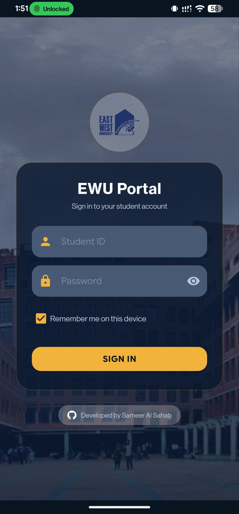
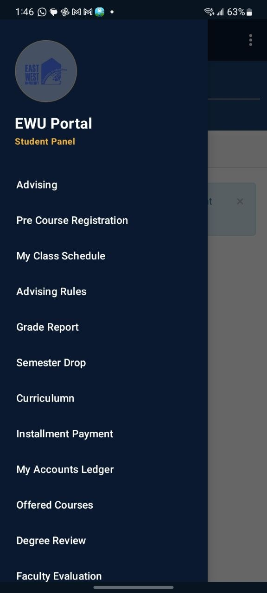
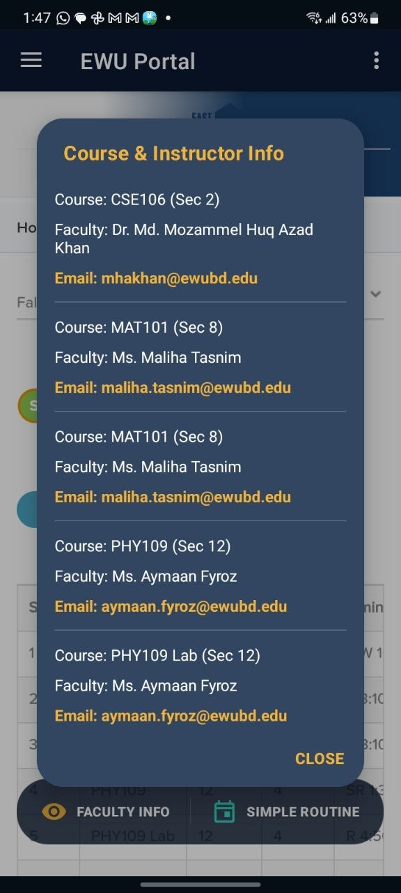
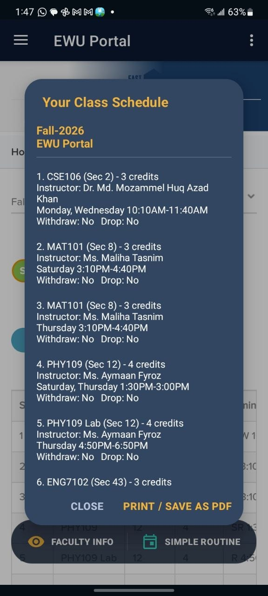
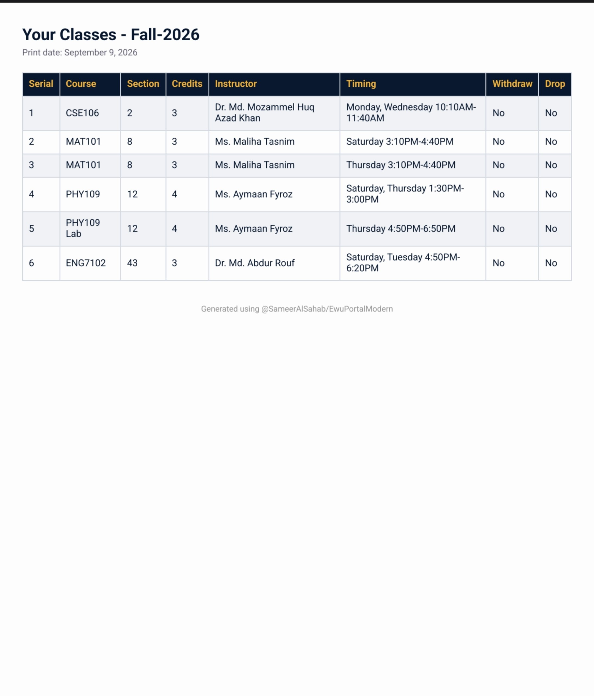
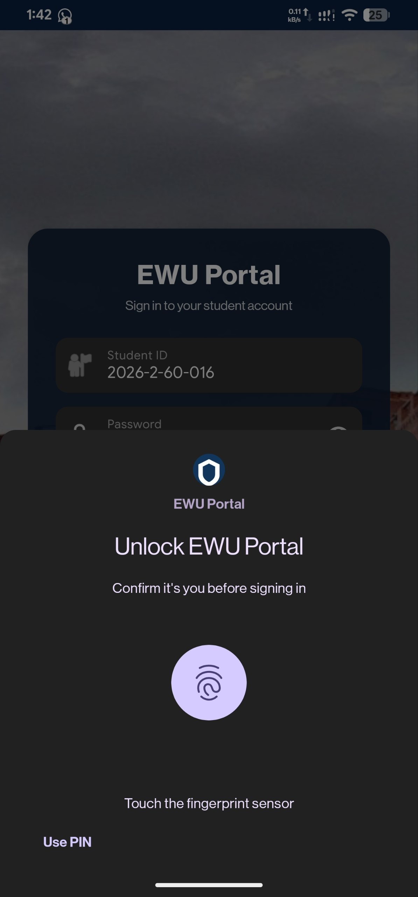

# East-West-University-Portal-App
Unofficial portal app with many useful features for EWU students.

## Screenshots

  
  
  
  
  
  

---

## Features

- **Auto-Fill Authentication:** Bypass manual math solutions and repeated ID/password inputs with saved credentials.
- **Biometric Security:** Secure access using fingerprint or device authentication.
- **Hidden Faculty Directory:** View hidden faculty names and email addresses directly.
- **Formatted Class Schedule:** Converts raw SRTS codes into readable days and times for daily routine management.
- **Mobile-Optimized Interface:** Responsive UI eliminates horizontal scrolling and excessive zooming on mobile devices.
- **Schedule Export to PDF:** Generates clean, print-friendly PDF files for class schedules.
- **Direct File Management:** Upload necessary academic documents directly through the app interface.
- **Academic Overview:** Fast access to course details, current grades, and historical results.

---

*Disclaimer: This is an independent, unofficial application created to improve user experience for students. It is not officially affiliated with, maintained by, or endorsed by East West University.*
