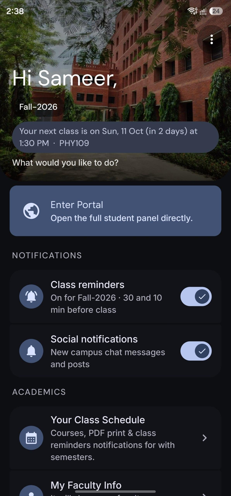
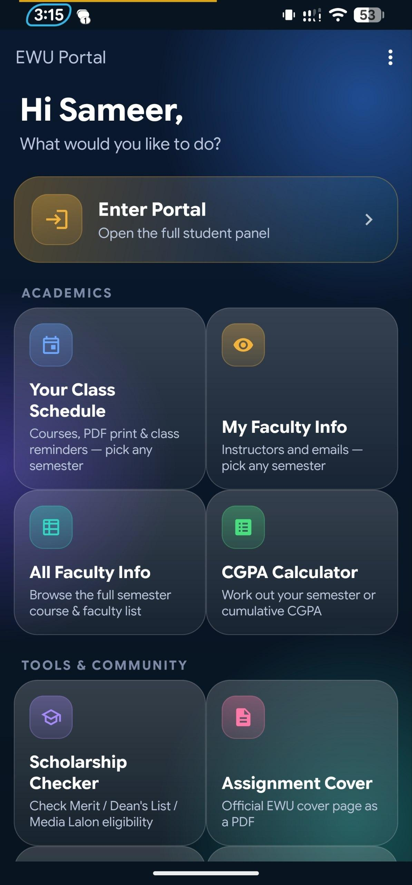
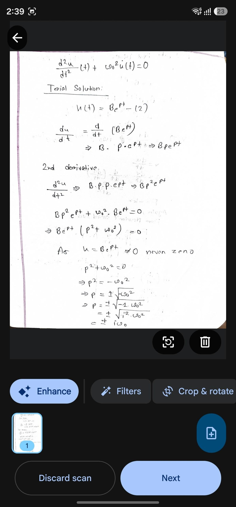
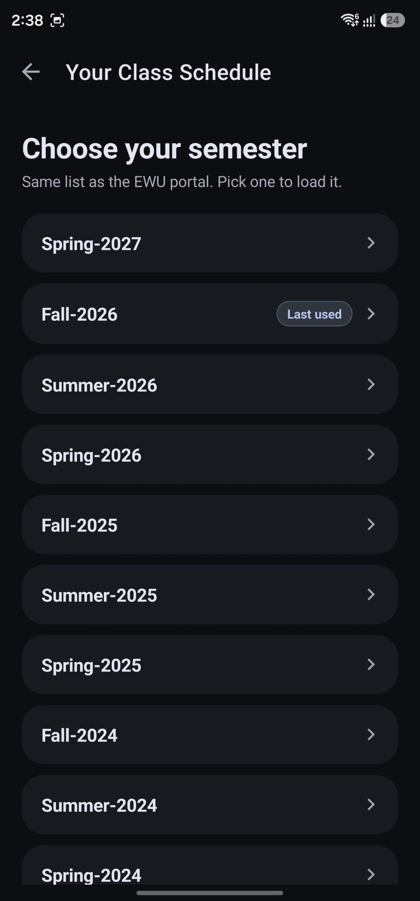
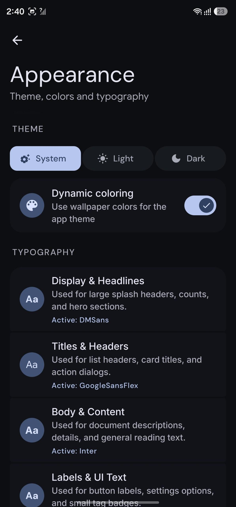

# East-West-University-Portal-App
Unofficial portal app with many useful features for EWU students.

 
**An unofficial, all-in-one Android app for East West University students.**
Sign in once and get your class schedule, reminders, faculty info, CGPA and scholarship tools, assignment covers, an exam focus mode and a student Q&A forum, all in one fast, mobile-friendly app.
 
> Stop fighting the zoomed-in desktop portal on your phone. Open the app, unlock, and you're in.
 
---

## Screenshots

  
  
  
  
  

### Academics
- **Your Class Schedule:**
  - Pick **any semester**.
  - Raw SRTS codes become readable days and times (`MW` becomes Monday, Wednesday).
  - Shows course, section, room, instructor, credits and withdraw/drop dates.
  - **Export to PDF:** A clean, print-friendly landscape PDF of your routine.
- **Class reminders:** Notifications **30 and 10 minutes before every class**, with course, section, time and room.
- **My Faculty Info:** Your instructors' names and **hidden email addresses** for any semester, with tap-to-copy.
- **All Faculty Info:** The full semester course, section, instructor and time list with **live search** by course, faculty or time.
- **CGPA Calculator:** Work out your semester GPA or your cumulative CGPA.
### Tools and community
- **Scholarship Checker:** Enter your CGPA and admission term to see whether you qualify for **100% Merit**, **Dean's List** or **Medha Lalon**, based on EWU's CGPA bands.
- **Assignment Cover Generator:** Creates the official EWU cover page as a **PDF**. Name and Student ID are pre-filled from your login, and the date defaults to today. Everything stays editable.
- **Exam Mode:** A focus lock that blocks distracting apps (social media, games and similar) while you study or sit an exam. It uses an Android Accessibility Service that you enable yourself.
- **Student Q&A Forum:**
  - Ask questions and answer classmates
  
### Document Scanner 
- **Free CamScanner, no watermark:** Scan with your camera or import photos. The app finds the page edges and crops them. Many pages become **one PDF**. No premium plan, no watermark.
- **Search inside your scans:** Turn on text recognition and find any document by a word written inside it. It runs **on your phone**, nothing is uploaded.
- **Sort and arrange your documents:** Sort the list by **name, date or size** (ascending or descending). Use **folders, tags and favorites** to keep everything in order. Deleted files stay in the bin for 30 days.

### Works offline 
- **Saved semesters:** Every semester you open is saved on your phone. Without internet you can still see your **rooms, times, sections and faculty info**.
- **Internet check:** If you open the portal with no internet, the app tells you. Class Schedule and Faculty Info show "No internet connection" and open your saved semesters instead.
- Reminders keep working without internet.

### Look and feel 
- **Material You (Monet) design** on every screen. Colors follow your wallpaper, or pick your own color and dark/light mode in **Appearance**.
- Feedback form in the app reaches the developer (me) directly.
---

Download from >> https://sameeralsahab.github.io/EastWestUniversity-Portal

*Disclaimer: This is an independent, unofficial application created to improve user experience for students. It is not officially affiliated with, maintained by, or endorsed by East West University.*

